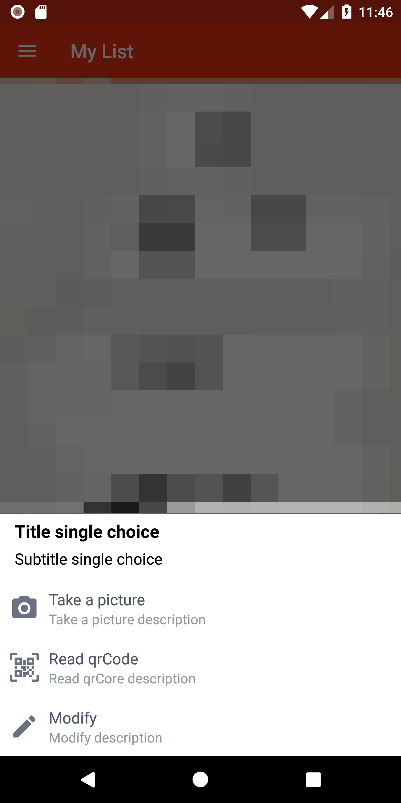

# SingleChoiceBottomMenu
An android library to show a single choice menu from bottom with a BottomSheetDialogFragment

### Example

    SingleChoiceBottomMenu
       .create()
       .setMenuTitle("Title single choice")
       .setMenuSubTitle("Subtitle single choice")
       .addMenuItem(R.drawable.camera, "Take a picture",
                    "Take a picture description") { view: View ->
               //OnClick
           }
       .addMenuItem(R.drawable.qrcode_scan, "Read qrCode",
                    "Read qrCore description") { view: View ->
               //OnClick
           }
       .addMenuItem(R.drawable.pencil, "Modify",
                    "Modify description") { view: View ->
               //OnClick
           }
       .show(activity.supportFragmentManager)
